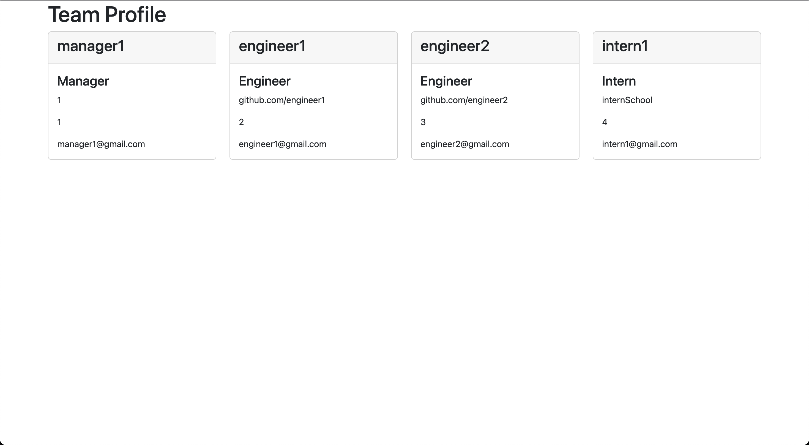

CONTENTS OF THIS FILE
---------------------
  * Description
  * Installation Instructions
  * Screenshots
  * Walkthrough
  
DESCRIPTION
-----------
A Node.js command-line application that takes in information about employees on a software engineering team, then generates an HTML webpage that displays summaries for each person. 

This is a command-line application that dynamically generates a HTML file from a user's input using the [Inquirer package](https://www.npmjs.com/package/inquirer/v/8.2.4). 


INSTALLATION INSTRUCTIONS
-------------------------
## Setup (if git and node are already installed, you may skip): 

For Windows, please download and install [git](https://git-scm.com/downloads) and [Node.js](https://nodejs.org/en/download/).

macOS users will need to install [Homebrew](https://brew.sh/). Then, run `brew install git` to install git, and `brew install node` to install Node.js.

Linux/BSD users should use their appropriate package managers to install git and Node.js, or build from source if you swing that way.

After that, [clone the Application](https://help.github.com/en/github/creating-cloning-and-archiving-repositories/cloning-a-repository).

When the cloning is done, open the Integrated Terminal in the respective directory. 

Run the following command in the terminal to install the packages: 

```bash
npm install
```

## Using the Application

Run the following command in the terminal to run the application: 

```bash
node index.js
```

Then, answer the questions (or choose an option) shown in the terminal. 

After all questions have been answered, an HTML file will have been generated in the 'dist' directory. 
You may edit and move it to wherever you please at that point.

SCREENSHOTS
-----------
The following image shows the web application's appearance:




WALKTHROUGH
-----------
The following link will show a walkthrough of the web application: 

[Team Profile Gen Walkthrough](https://drive.google.com/file/d/1DZ99kl5daYTur9bab_UHEANSqYuYFQ_S/view)

QUESTIONS
---------
If you have any questions or concerns, please contact me through my email below: 

kimdillon19@gmail.com

[https://github.com/dillonkim19](https://github.com/dillonkim19)

